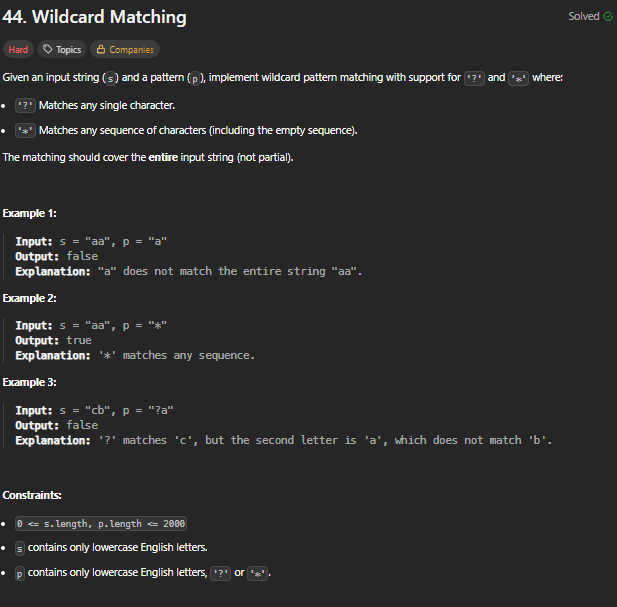
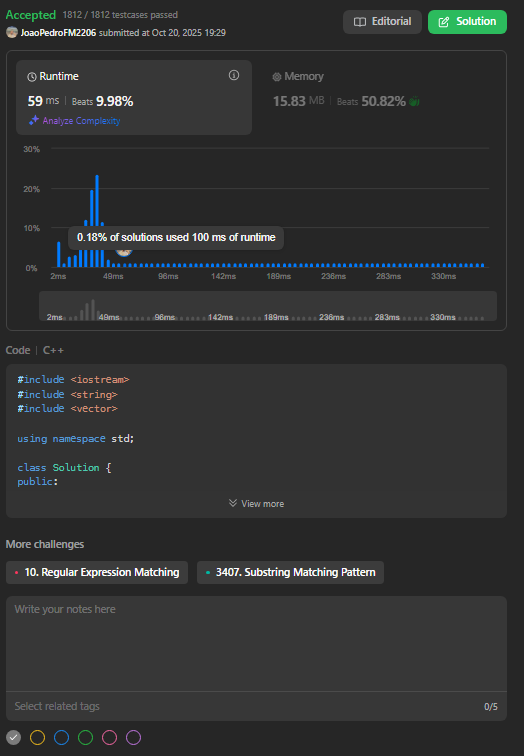
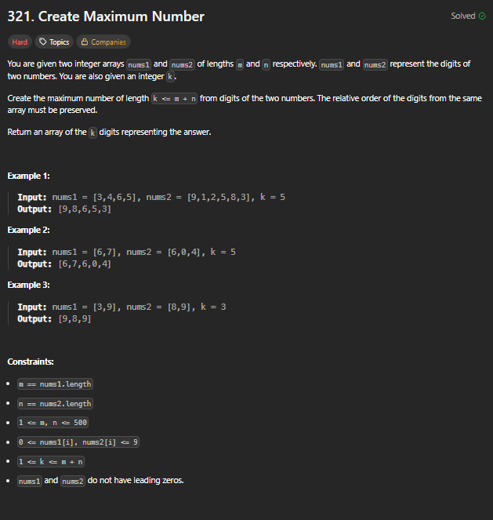
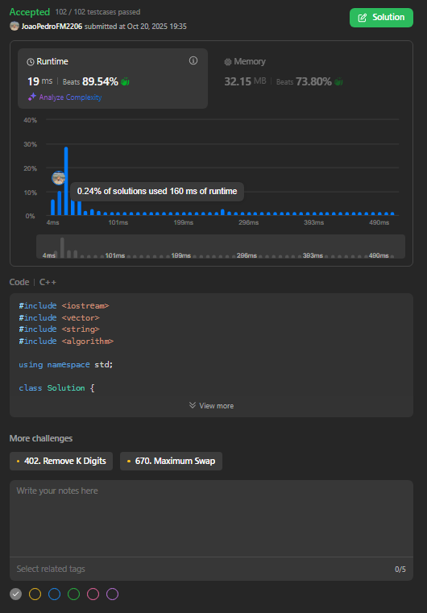
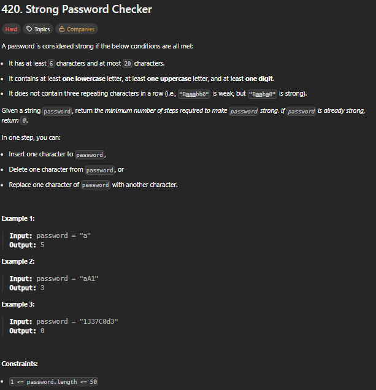
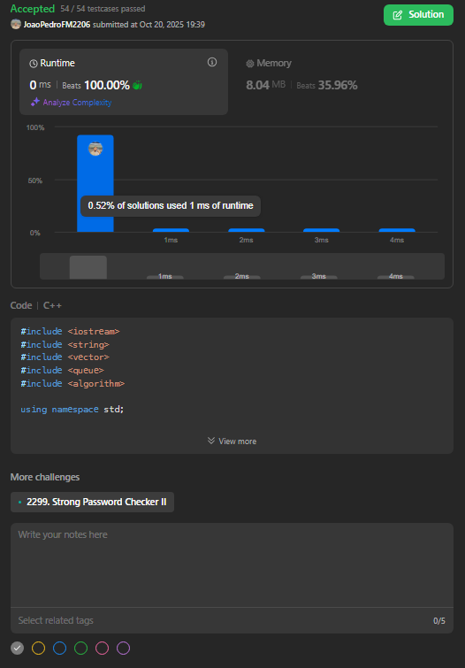

# Trabalho 2: Soluções de Algoritmos Ambiciosos (LeetCode)

**Disciplina**: Projeto de Algoritmos (FGA0124) 

**Professor**: Maurício Serrano

## 📖 Sobre o Projeto

Este repositório contém as soluções desenvolvidas para o **Trabalho 3** da disciplina de Projeto de Algoritmos. O objetivo principal foi aplicar e demonstrar o conhecimento teórico adquirido em aula através da resolução de desafios práticos da plataforma LeetCode.

Nós selecionamos e implementamos a solução para três problemas, sendo os três de nível Difícil, focando em diferentes algoritmos e estruturas de dados, como Estratégias Ambiciosas (Greedy).

## 👥 Equipe

| Matrícula  | Aluno                               |
| :--------- | :---------------------------------- |
| 231028989  | Joao Pedro Ferreira Moraes          |
| 231026680  | Cibelly Lourenço Ferreira           |

## 🛠️ Tecnologias Utilizadas

- **Linguagem:** C++

## 🚀 Desafios Resolvidos

Abaixo estão detalhados os problemas abordados, com uma breve explicação da estratégia utilizada e o comprovante de submissão.

---
### 1. [44. Wildcard Matching](https://leetcode.com/problems/wildcard-matching/description/)

#### **Estratégia: Algoritmo Ambicioso (Greedy) com Backtracking** 
A estratégia utilizada foi uma solução otimizada em espaço ($O(1)$) que usa uma abordagem ambiciosa (greedy) com backtracking.

- A ideia é usar dois ponteiros (`s_ptr`, `p_ptr`) para avançar na string e no padrão, tentando sempre uma correspondência direta.
- O `*` é o ponto-chave. Quando um `*` é encontrado, salvamos sua posição (`star_ptr`) e a posição correspondente em `s` (`s_match_ptr`). Em seguida, avançamos `p_ptr` (esta é a escolha ambiciosa: assumimos que o `*` corresponde a 0 caracteres).
- Se uma falha (mismatch) ocorre, verificamos se já vimos um `*`.
- Se sim, fazemos o backtracking:
    - 1.Restauramos `p_ptr` para a posição após o `*` salvo.
    - 2.Avançamos `s_match_ptr` em 1 (fazendo o `*` "comer" 1 caractere).
    - 3.Movemos `s_ptr` para essa nova posição `s_match_ptr`.
- Se a falha ocorre e não há `*` para fazer backtrack, a correspondência falha.

**Submissão:**
[Submissão LeetCode 44](https://leetcode.com/problems/wildcard-matching/submissions/1807087294)

### 2. [321. Create Maximum Number](https://leetcode.com/problems/create-maximum-number/description/)

#### **Estratégia:** 
A estratégia para este problema é complexa e foi dividida em três subproblemas principais, todos baseados em uma lógica ambiciosa (greedy):

- **1. maxArray(nums, k) (Sub-rotina 1):** Primeiro, criamos uma função que, dado um único array nums, encontra a maior subsequência lexicográfica de tamanho k. Isso é feito usando uma abordagem de "pilha": iteramos pelo array e, se encontrarmos um número maior que o topo da pilha (e ainda tivermos "remoções" permitidas), removemos o topo para manter a sequência o maior possível.

- **2. merge(arr1, arr2) (Sub-rotina 2):** Segundo, criamos uma função que junta dois arrays (ambos já sendo "max arrays" de suas fontes) para formar o maior array combinado possível. A lógica é similar ao merge sort, mas com um detalhe crucial: se arr1[i] == arr2[j], não podemos simplesmente escolher qualquer um. É preciso "olhar para frente" (ex: comparar [6,7] vs [6,0]) para tomar a decisão ambiciosa correta.

- **3. Loop Principal (Solução):** A função principal itera por todas as partições possíveis de k. Ou seja, ela tenta pegar i dígitos de nums1 e j dígitos de nums2, onde i + j = k. Para cada partição (i, j), ela chama maxArray(nums1, i) e maxArray(nums2, j), e então junta os resultados usando merge. O maior array resultante de todas as iterações é a resposta final.

**Submissão:**
[Submissão LeetCode 321](https://leetcode.com/problems/create-maximum-number/submissions/1807090880)

### 3. [420. Strong Password Checker](https://leetcode.com/problems/strong-password-checker/description/)

#### **Estratégia:** 
Esta é uma questão de otimização complexa onde a estratégia ambiciosa (greedy) ideal depende do comprimento da senha. O objetivo é corrigir três falhas (comprimento, tipos de caracteres, repetições) com o mínimo de passos (inserir, excluir, substituir).

A lógica foi dividida em três casos baseados no comprimento (n):

- **1. Caso 1:** n < 6 (Senha Curta)
    - Somos forçados a inserir 6 - n caracteres.
    - A escolha ambiciosa é assumir que cada inserção pode também corrigir um tipo de caractere ausente (missingTypes).
    - `Passos = max(6 - n, missingTypes)`
- **2. Caso 2:** 6 <= n <= 20 (Tamanho Ideal)
    - Não precisamos de inserções ou exclusões. A operação ideal é a substituição.
    - A escolha ambiciosa é que uma substituição pode corrigir simultaneamente um tipo ausente e quebrar uma sequência repetida.
    - Passos = max(missingTypes, totalRepeatChanges), onde totalRepeatChanges é a soma de L/3 para cada repetição de comprimento L.
- **3. Caso 3:** n > 20 (Senha Longa)
    - Somos forçados a excluir n - 20 caracteres.
    - A estratégia ambiciosa é usar essas exclusões da forma mais eficiente possível: para reduzir o número de totalRepeatChanges que precisaremos fazer depois.
    - Usamos uma Fila de Prioridade (ordenada por L % 3) para gastar as exclusões primeiro em repetições L % 3 == 0 (custo 1, maior benefício), depois L % 3 == 1 (custo 2), e por último L % 3 == 2 (custo 3).
    - `Passos = (n - 20) + max(missingTypes, totalRepeatChanges_restantes).`

**Submissão:**
[Submissão LeetCode 420](https://leetcode.com/problems/strong-password-checker/submissions/1807092210)

---

## 🎬 Vídeo de Apresentação

A explicação detalhada do raciocínio por trás de cada solução pode ser encontrada nos vídeos abaixo:

[44. Wildcard Matching](https://youtu.be/zT4kL60FEXw)

[321. Create Maximum Number](https://youtu.be/HjgxDimoj1s)

[420. Strong Password Checker](https://youtu.be/Wm5z0S9GEy8)

